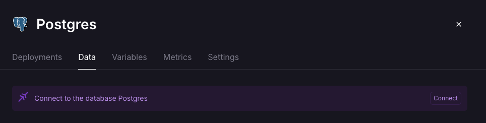
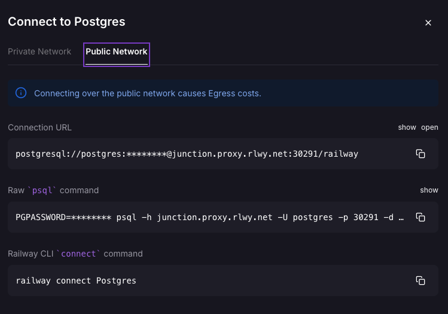
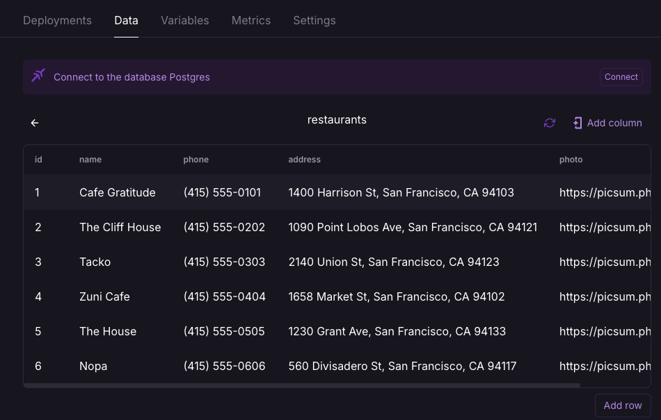

# CSC317-F24-4: Databases

In this project, you will build on your website from Project 3 and add a database to persist your data.

Goals for this assignment:
* learn how to set up and connect a web application to to a database
* seed a database with a set up script
* use SQL to declare database models, query data, and make updates


## Time taken to complete this project:

```
# replace me!
```


## Section 1: Project Set Up

As in the last project, you should accomplish your work within the `server/` directory.

### Migrate the files from Project 3

Copy over your entire `server/` directory form project 3. This should include the following files:

* `data`
    * `restaurants.js`
    
        In-memory module for retrieivng and updating resaturant data.
        We'll be replacing the array with a database.
* `public`
    * HTML files
    * CSS files
    * JS scripts for DOM manipulation
    * static images
* `routes`
    * `api.js`: POST and PATCH routes
* `views`
    * EJS Templates
* `package.json` and `package-lock.json`
* `server.js`: the main server entrypoint

### New Files and Dependencies

For this project, you will be adding a few files:

* `config` 
    * `database.js`
    
        Module to initialize connection to the database. to be implemented in this project.
    * `seed-db.js`
    
        Script that "seeds" (or initializes) the data in the db. to be implemented in this project
* `.env` 
    * environment variable file 
    
        Should be directly under `server/`

        For local development only --
        do NOT include in the submission.
    
        The `.gitignore` file already excludes it from git commits.
* new node modules 
    * use `npm install` too add these to `package.json`
        * `pg` - module for connecting to the database
        * `dotenv` - module for importing environment variables

## Section 2: Setting Up a Connection to the DB

The goal of this section is to set up a Postgres DB and connect our web app to it. 


### Start a Postgres Instance on Railway

In this project, we're going to set up a Postgres instance through a web service called Railway. Go to the [Railway website](https://railway.app/) and create an account. After you're done, click on `Start a New Project` and `Deploy PostgreSQL`. This will kick off creating a new Postgres instance on Railway for you. It might take a couple minutes to complete.

    We're using Railway instead of hosting our own Postgres instance. This is so we can minimize how much we worry about "setting up" the DB, we just let Railway take care of that. We just need to connect to it over the internet.

    If you feel strongly about wanting to try implementing this using a postgres instance on your local machine, come talk to me. The set up will be a little different.

Once your Railway postgreSQL instance is ready, open up the dashboard. Under `data`, click the `Connect` button on the far right. 
 

This should pop up a modal. Select `Public Network`, and copy and paste the `Connection URL`.
 

This is the address you'll point your web app to. Set up an environment variable in your `.env` file with the `Connection URL` as the value.

### Connect to the DB
Take a look at `database.js` in `config/`. There's some initial code there. 

Fill it out to use the environment variable you defined in the step above to set up the connection settings to the DB. Do NOT hardcode your DB connection string into your app. That value should stay in your `.env` file. This makes it easy to update config values, and also keep your DB credentials safe.

Now, you should be able to import the `pool` object from `database.js` when you want to establish a conenction to the database.

## Section 3: Setting Up the Seed Script

The goal of this section is to write a script that sets up our database schema
and populate it with some initial data. 
It's the same restaurant data that you've been using for your previous projects.

Take a look at `seed-db.js` in `config/`. Set up a script entry in `package.json` called `seed-db` that runs the `seed-db.js` script. To get credit for this portion, you should be able to run this script with `npm run seed-db`.

There are 3 functions in the script: `dropTables`, `createTables`, and `insertData`. `dropTables` already drops the `restaurants` table.

In `createTables`, use a SQL `CREATE` statement to create a `restaurant` table. A restaurant should have the same fields as it has had up until now -- `name`, `phone`, `address`, and `photo`. It should also have an `id` column that automatically assigns an id to a new entry.

In `insertData`, use SQL `INSERT` statements to add your restaurant data to the `restaurant` table 

Try running the script with `npm run seed-db`. Check that the table is created and the data you inserted is updated on the Railway instance you are connected to. You should be able to see it under the Data tab.



This script will be run during grading, so make sure it works before you submit.

Nice! You can now use this script anytime you want to reset the data to the initial data while working on this project.


## Section 4: Use SQL for Restaurant Data

The goal of this section is to update our calls in the `data/restaurants.js` module
to query and update data from the database.

Start by removing the `restaurantsData` array and `nextId()` function.

Update the functions to read and write the restaurant data in the database instead of out of an array. Use the `config/database` module you defined in Part 2, and make the appropriate SQL queries,

* `getRestaurants()` should return a list of all restaurants
* `getRestaurant(id)` should return the details for a specific restaurant
* `createRestaurant(newRestaurant)` should take a JS object,
and add a new restaurant entry to the database
* `deleteRestaurant(id)` should delete a restaurant from the database

Nice, you now have a web app that persists changes to your restaurant data! Changes to the restaurant data will now be saved between server restarts. You should be able to add and delete restaurants from your frontend and watch your data update!

### A Note on Using Railway

Railway is a free service which means that sometimes commands might run a bit slowly. For example, something I've observed is that deleting a card on the frontend kicks of the delete request to Railway, but if the changes take a few second to propagate, but the fetch request's callback handler might trigger to early and reload the page before record is "properly deleted" from Railway. But, if you refresh 5 seconds later, Railway will have successfully deleted the record, and the card correctly disappears from your frontend as well.

To avoid getting tripped up on this, I suggest keeping the Railway data tab open in a separate browser tab so that after you interact with your server's frontend, you can go check what's happening on the DB. For example, after you click on the delete button, wait 2-3 seconds to see if the record you clicked the delete button for disappears from Railway. If it does, then things are working as expected -- Railway is just being a bit slow, so don't worry about it.

## Section 5: Add Restaurant Reviews

The goal of this section is to add reviews to our data model.

Update `seed-db.js` to create a table called `reviews`. `restaurants` and `reviews` have a 1 to many relationship.

A review should have an integer `id`, integer `rating`, and text `content`. Since a review is associated with a restaurant, make sure to include a `restaurant_id` column as well, and bind it to the `restaurant.id` column with a foreign key constraint.

When you update `dropTables()` in the seed script, make sure that you drop the `reviews` table BEFORE the `restaurants` table. Otherwise, postgres will complain since doing that will leave all of the restaurant references in `reviews` to point at nothing.

Edit `insertData` so that it inserts at least 2 reviews for 2 restaurants. Phrased another way, there should be at least 4 reviews in total and at least 2 restaurants should have reviews. You're welcome to add more if you'd prefer.

Lastly, in `data/restaurants.js`, add a function `getReviewsForRestaurant(id)` that returns a list of reviews associated with a given restaurant id. Make sure this function makes the appropriate SQL query to retrieve this data. You shouldn't need anything fancy -- a `WHERE` clause is sufficient.

Congrats, you've finished the required portion of this project!


## Bonus: Reviews in the Frontend

This portion is for bonus points. The goal is to close the loop on the reviews and render the restaurant reviews on the restaurant details page. We'll do this by piping the reviews data through to the frontend.

In the restaurant details route (`/resturants/:id`), use `reviewsForRestaurant` to get the reviews for that resturant, and add it to the data passed in for rending the restaurant details EJS template. Update the template to render the review
ratings and content. 

Feel free to style the reviews on your frontend as you'd like. To get credit for this portion, the review content should be rendered in the template and visible from a web browser.


# Rubric

Total Points: 45

Bonus Points: 5

|Project Setup and Migration| 2 |
|---|---|
|Successful migration of Project 3 |	2

| Set up DB Connection | 6 |
|---|---|
|Correct set up of DB pool	| 3
|Correct set up of environment variables	| 3

| DB Seed Script | 8 |
|---|---|
|	Correct set up of seed script in `package.json` |	2
|	Correct set up `restaurants` table schema |	3
|	Correct set up initial restaurant data |	3


| DB CRUD Operations for Restaurant Data	| 15 |
|---|---|
|	Correct SQL implementation of `getRestaurant`  |	3
|	Correct SQL implementation of `getRestaurants`  |	3
|	Correct SQL implementation of `createRestaurant`  |	3
|	Correct SQL implementation of `updateRestaurant`  |	3
|	Correct SQL implementation of `deleteRestaurant`  |	3


| Relational Data: Restaurant Reviews	| 10 |
|---|---|
|   Correct set up of `reviews` table columns  |	2
|   Add review entries to the seed script |	2
|   Correct set up of `reviews` to `restaurant` relationship  | 3	
|   Correct implementation of `getReviewsForRestaurant` to return the reviews associated with a restaurant   |	3

|Overall Code Quality and Best Practices	| 4 |
|---|---|
|Clean, reasonably-organized code	| 4

Bonus: 

| Restaurant Reviews - Frontend	| 5 |
|---|---|
|   Update the router that renders the restaurant details template to query and ingest restaurant review data from the db |	2
|   Update the restaurant details template and render reviews on the frontend |	3
